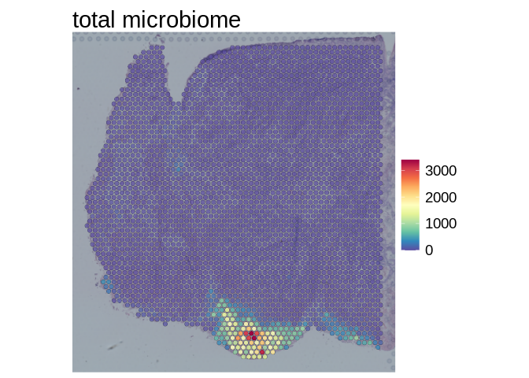
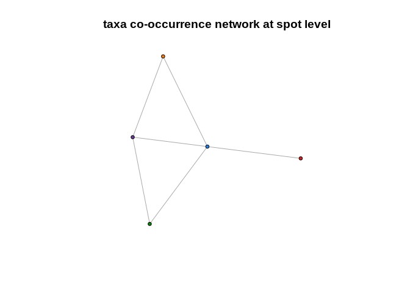

<!-- README.md is generated from README.Rmd. Please edit that file -->

# microbiome10XVisium

<!-- badges: start -->
<!-- badges: end -->

microbiome10XVisium is part of the *SpatialMicrobe* computational
framework, which allows to profile microbial reads from 10XVisium
Spatial Gene Expression data. It is used downstream of the snakemake
workflow X.

## Installation

You can install the development version of microbiome10XVisium from
[GitHub](https://github.com/) with:

``` r
# install.packages("devtools")
devtools::install_github("bedapub/spatial-microbe")
```

## Basic use case

``` r
library(microbiome10XVisium)
```

We are going to demonstrate the basic workflow to profile microbial
reads in 10X Visium spatial transcriptomics samples with the CRC_16
sample. The CRC_16 sample is a colorectal cancer sample form the
Galeano-Niño et al. (Nature 2022) publication. It is expected that the
snakemake workflow was run beforehand.

The steps of the workflow involve:

1)  **krakenToMatrix()**: barcode correction, UMI deduplication and
    resolving the reads at a specific taxonomic level
2)  **decontaminate()**: running various decontamination steps and
    adding the microbiome information as an additional assay to a Seurat
    object containing the GEX assay
3)  Downstream analysis and visualization, such as visualizing the
    pseudobulk microbiome composition, spatial profiles of certain
    microbes or co-occurrence of taxa in spots.

### Preparation

In case of using the microbiome10XVisium for the first time, it is
required to download a SQLite DB for taxonomic conversion (performed
with the *taxonomizr* R package, for more info:
<https://github.com/sherrillmix/taxonomizr>). Run the following code
once:

``` r
library(taxonomizr)
taxonomizrDB = "DESIRED/FILEPATH/FOR/SQLite/DB/nameNode.sqlite"
taxonomizr::prepareDatabase(sqlFile=taxonomizr_DB, getAccessions=FALSE)
```

Specify the location of the SQLite DB for downstream use:

``` r
taxonomizrDB="/projects/site/pred/microbiome/database/taxonomizr_DB/nameNode.sqlite"
```

### krakenToMatrix()

The first step is to convert the output from the bioinformatic pipeline
(\*\_kraken_output.txt file consisting of three columns BC, UMI and
taxid) into a taxid-spot matrix at a particular taxonomic level, similar
to the gene-spot matrix for host transcriptomics. The function
krakenToMatrix() performs this, while also performing barcode
correction, resolving the taxonomic classifications of the reads to a
specific taxonomic level (recommended: genus level) and collapsing reads
into UMI counts.

Running **krakenToMatrix()** with default settings
(i.e. tax_level=“genus” and counts=“umi_counts”):

``` r
k2m <- krakenToMatrix(
  filePath=system.file("extdata", "CRC_16", "CRC_16_profiling-output.txt.gz", package="microbiome10XVisium"),
  outDir=system.file("extdata", "CRC_16/", package="microbiome10XVisium"), taxonomizrDB=taxonomizrDB)
#> [1] "325112 total microbial read counts at genus level"
#> Joining, by = "barcode"
#> [1] "output saved as RDS file at /home/anzboecs/R/x86_64-pc-linux-gnu-library/4.0.5-foss/microbiome10XVisium/extdata/CRC_16//genus_umi_counts.RDS"
```

This returns a list consisting of \$taxid_counts (a dataframe with the
pseudobulk composition of the sample) and \$matrix (the microbiome
taxid-spot matrix).

``` r
knitr::kable(head(k2m$taxid_counts, n=5))
```

| counts | superkingdom | phylum         | genus         | taxid |
|-------:|:-------------|:---------------|:--------------|:------|
| 156677 | Bacteria     | Fusobacteria   | Fusobacterium | 848   |
|  73756 | Bacteria     | Bacteroidota   | Bacteroides   | 816   |
|  17239 | Bacteria     | Fusobacteria   | Leptotrichia  | 32067 |
|  15610 | Bacteria     | Proteobacteria | Campylobacter | 194   |
|  13593 | Bacteria     | Firmicutes     | Gemella       | 1378  |

As we can see, the top 5 taxa detected in this sample are
**Fusobacterium**, **Bacteroides**, **Leptotrichia**, **Campylobacter**
and **Gemella**.

``` r
dim(k2m$matrix)
#> [1]  962 4992
```

All in all, 962 genera were detected in the 4992 spots of the 10X Visium
tissue slide.

### decontaminate()

The next step is to decontaminate the taxid-spot matrix. There are
multiple options for decontamination and we recommend an iterative
approach for each dataset to find the optimal decontamination strategy.
The decontamination can be performed on four levels:

1)  **removeSingletons**: removes singleton counts (i.e. values of 1 in
    the taxid-spot matrix), which are probable false-positives from the
    taxonomic classification process.
2)  **removeLikelyContaminants**: removes taxa that are likely
    contaminants (defined by Poore et al. (Nature 2020)).
    **removeSpecificTaxa**: removes additional taxa defined by the users
    that seem to be contaminants, but are not included in the list (for
    example Mycobacterium).
3)  **selectGastrointestinal**: only keeps taxa that are likely
    gastrointestinal (oral or fecal) commensals (defined by Schmidt et
    al. (eLife 2019)).
4)  **spots**: this selects spots from the 10X Visium slide. The 10X
    Visium tissue slide consists of 4992 spots, but only some of the
    spots are covered by tissue (termed “tissueOnly”). The user has the
    option to only choose tissue-covered spots (“tissueOnly”),
    tissue-covered spots and additionally spots that are bordering the
    tissue (“tissuePlusBordering”) or to select all spots on the slide
    (“all”). We propose to run “all” first to get an overview of the
    microbial signal on the slide, and then to choose either
    “tissueOnly” or “tissuePlusBordering” (in case of high microbial
    signal in tissue bordering region) for the final decontaminated
    version.

#### all spots

``` r
#all spots
CRC_16_all <- decontaminate(sampleName = "CRC_16",
              object=k2m,
              spacerangerDir = system.file("extdata", "outs/", package="microbiome10XVisium"),
              outDir = system.file("extdata", "CRC_16/", "vignette/", package="microbiome10XVisium"),
              spots="all",
              removeSingletons=TRUE,
              removeLikelyContaminants = TRUE,
              taxonomizrDB=taxonomizrDB)
#> [1] "962 taxa present before contamination"
#> [1] "325112 counts present before contamination"
#> 
#> Decontamination step: removing singleton counts[1] "737 taxa eliminated."
#> [1] "18997 counts eliminated."
#> 
#> Decontamination step: removing taxa that are likely contaminants[1] "31 taxa eliminated:"
#>  [1] "Flavobacterium genus was removed"    "Buchnera genus was removed"         
#>  [3] "Eikenella genus was removed"         "Pectobacterium genus was removed"   
#>  [5] "Chryseobacterium genus was removed"  "Paenibacillus genus was removed"    
#>  [7] "Treponema genus was removed"         "Pseudomonas genus was removed"      
#>  [9] "Blattabacterium genus was removed"   "Photobacterium genus was removed"   
#> [11] "Brevundimonas genus was removed"     "Mucilaginibacter genus was removed" 
#> [13] "Herbaspirillum genus was removed"    "Xenorhabdus genus was removed"      
#> [15] "Moraxella genus was removed"         "Pseudoalteromonas genus was removed"
#> [17] "Endozoicomonas genus was removed"    "Xanthomonas genus was removed"      
#> [19] "Rhodococcus genus was removed"       "Pedobacter genus was removed"       
#> [21] "Paracoccus genus was removed"        "Halomonas genus was removed"        
#> [23] "Sphingobium genus was removed"       "Pasteurella genus was removed"      
#> [25] "Psychrobacter genus was removed"     "Paenisporosarcina genus was removed"
#> [27] "Chitinophaga genus was removed"      "Dyadobacter genus was removed"      
#> [29] "Massilia genus was removed"          "Polaribacter genus was removed"     
#> [31] "Microlunatus genus was removed"     
#> [1] "3767 counts eliminated"
#> 
#> [1] "Decontamination step: only keeping taxa that are present in all spots"
#> [1] "194 taxa remaining after decontamination"
#> [1] "303568 counts remaining after decontamination"
```

Looking at the spatial microbiome profile after this round of
decontamination:

``` r
spatialPlot(CRC_16_all, taxa="all", taxonomizrDB=taxonomizrDB)
```


We can see that most of the signal is located in tissue-covered spots
and detect that there is a weird area with high microbial signal on the
left, not related to the tissue. Thus we can proceed with only including
the tissue-covered spots (“tissueOnly”).

#### only considering tissue-covered spots

``` r
#all spots
CRC_16_tissueOnly <- decontaminate(sampleName = "CRC_16",
              object=k2m,
              spacerangerDir = system.file("extdata", "outs/", package="microbiome10XVisium"),
              outDir = system.file("extdata", "CRC_16/", "vignette/", package="microbiome10XVisium"),
              spots="tissueOnly",
              removeSingletons=TRUE,
              removeLikelyContaminants = TRUE,
              taxonomizrDB=taxonomizrDB)
#> [1] "962 taxa present before contamination"
#> [1] "325112 counts present before contamination"
#> 
#> Decontamination step: removing singleton counts[1] "737 taxa eliminated."
#> [1] "18997 counts eliminated."
#> 
#> Decontamination step: removing taxa that are likely contaminants[1] "31 taxa eliminated:"
#>  [1] "Flavobacterium genus was removed"    "Buchnera genus was removed"         
#>  [3] "Eikenella genus was removed"         "Pectobacterium genus was removed"   
#>  [5] "Chryseobacterium genus was removed"  "Paenibacillus genus was removed"    
#>  [7] "Treponema genus was removed"         "Pseudomonas genus was removed"      
#>  [9] "Blattabacterium genus was removed"   "Photobacterium genus was removed"   
#> [11] "Brevundimonas genus was removed"     "Mucilaginibacter genus was removed" 
#> [13] "Herbaspirillum genus was removed"    "Xenorhabdus genus was removed"      
#> [15] "Moraxella genus was removed"         "Pseudoalteromonas genus was removed"
#> [17] "Endozoicomonas genus was removed"    "Xanthomonas genus was removed"      
#> [19] "Rhodococcus genus was removed"       "Pedobacter genus was removed"       
#> [21] "Paracoccus genus was removed"        "Halomonas genus was removed"        
#> [23] "Sphingobium genus was removed"       "Pasteurella genus was removed"      
#> [25] "Psychrobacter genus was removed"     "Paenisporosarcina genus was removed"
#> [27] "Chitinophaga genus was removed"      "Dyadobacter genus was removed"      
#> [29] "Massilia genus was removed"          "Polaribacter genus was removed"     
#> [31] "Microlunatus genus was removed"     
#> [1] "3767 counts eliminated"
#> 
#> [1] "Decontamination step: only keeping taxa that are present in tissueOnly spots"
#> [1] "155 taxa remaining after decontamination"
#> [1] "183376 counts remaining after decontamination"
```

Through the decontamination process we reduced the total number of taxa
detected from 962 to 155.

Looking at the spatial microbiome profile after this round of
decontamination:

``` r
spatialPlot(CRC_16_tissueOnly, taxa="all", taxonomizrDB=taxonomizrDB)
```



### Downstream analyis and visualization

To get an overview of what the most abundant microbial taxa are in this
sample after decontamination, we can have a look at the \$taxid_counts
dataframe.

``` r
knitr::kable(head(CRC_16_tissueOnly$taxid_counts))
```

| counts | superkingdom | phylum         | genus         | taxid  |
|-------:|:-------------|:---------------|:--------------|:-------|
|  96457 | Bacteria     | Fusobacteria   | Fusobacterium | 848    |
|  39228 | Bacteria     | Bacteroidota   | Bacteroides   | 816    |
|  12826 | Bacteria     | Fusobacteria   | Leptotrichia  | 32067  |
|   8070 | Bacteria     | Firmicutes     | Gemella       | 1378   |
|   7922 | Bacteria     | Proteobacteria | Campylobacter | 194    |
|   3778 | Bacteria     | Firmicutes     | Bulleidia     | 118747 |

#### Spatial profiles

Looking at the spatial profile of one of the highly abundant taxa:

``` r
spatialPlot(CRC_16_tissueOnly, taxa="Fusobacterium", taxonomizrDB=taxonomizrDB)
```


Investigating the spatial composition of the sample in a Shiny plot
(only works interactively!)

``` r
#interactive_spatialPlot(object=CRC_16_tissueOnly)
```

#### Co-occurrence analysis

We can also investigate whether certain taxa co-occur in the same spots.

Looking at the number of taxa that are detected in each spot:

``` r
spatialPlot(object=CRC_16_tissueOnly, taxa="nTaxa") + ggplot2::ggtitle("nTaxa detected")
```


There are definitely multiple taxa per spot in the spots with high
microbial signal!

Creating a co-occurrence network (at different SparCC correlation
thresholds):

``` r
cooccurrenceNetwork(object=CRC_16_tissueOnly, threshold=0.5) 
```



There seems to be some co-occurrence of the top 5 most abundant taxa in
the sample: **Fusobacterium**, **Bacteroides**, **Leptotrichia**,
**Campylobacter** and **Gemella**.

#### Pseudobulk analyis

Moving away from the spatial profiles and looking at the pseudobulk
relative abundance profiles instead:

``` r
pseudoBulkProfile(sampleName="CRC_16", object=CRC_16_tissueOnly) + ggplot2::ggtitle("")
```


### exporting the decontaminated taxid-spot matrix

The decontaminated taxid-spot matrix can be exported as csv file - to be
integrated into other analyses (outside of R and the Seurat package).

``` r
# with taxids as matrix rownames
export_matrix(object=CRC_16_tissueOnly, rownames="taxid", outDir=system.file("extdata", "CRC_16/", package="microbiome10XVisium"), taxonomizrDB=taxonomizrDB)
# with genus names as matrix rownames
export_matrix(object=CRC_16_tissueOnly, rownames="genus", outDir=system.file("extdata", "CRC_16/", package="microbiome10XVisium"), taxonomizrDB=taxonomizrDB)
```
